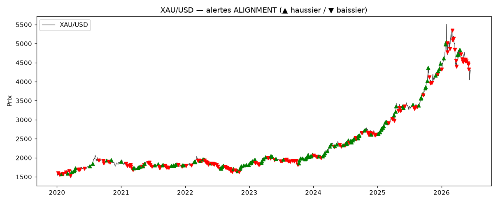
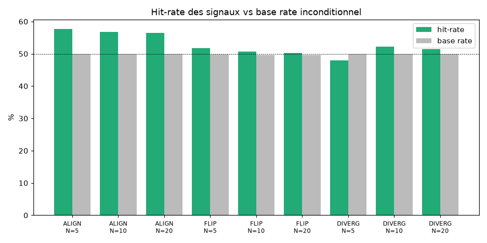

# Rapport de calibration — Gold Macro Engine (Phase 5)

**Date :** 2026-06-25 · **Données :** 2020-01-02 → 2026-06-15 (2006 jours)
**Sources :** XAU (xau-system M5→D1), FRED (DFII10/DGS10/DTWEXBGS), COT CFTC (point-in-time).
**Périmètre :** signaux MACRO (structurel + tactique). La couche sentiment est
absente du backtest (pas d'historique de positionnement/news) — non évaluée ici.

> Réplay **causal** (z-scores et momentum calculés uniquement sur données ≤ T,
> aucun look-ahead). Tout hit-rate est comparé au **base rate** inconditionnel
> (l'or a monté sur la période → un signal "haussier" paraît bon par défaut ;
> l'edge réel = au-dessus du base rate).

## Volume d'alertes
BIAS_FLIP=1322, ALIGNMENT=281, DIVERGENCE=695
Base rate (P[or monte]) : 5j=56.4% · 10j=58.1% · 20j=59.9%

## ALIGNMENT (les 2 timeframes convergent)
| Horizon | n | hit-rate | base rate | **edge** | avg fwd (dir) |
|---:|---:|---:|---:|---:|---:|
| 5j | 281 | 57.7% | 49.9% | **+7.7pp** | +0.3% |
| 10j | 280 | 56.8% | 49.9% | **+6.8pp** | +0.36% |
| 20j | 278 | 56.5% | 50.0% | **+6.5pp** | +0.36% |

→ **Seul signal avec un edge net et persistant** (~+5pp au-dessus du base rate, toutes
fenêtres). C'est le signal actionnable.

## BIAS_FLIP (croisement de zéro structurel)
| Horizon | n | hit-rate | base rate | **edge** | avg fwd (dir) |
|---:|---:|---:|---:|---:|---:|
| 5j | 1102 | 51.8% | 49.8% | **+2.0pp** | +0.08% |
| 10j | 1101 | 50.7% | 49.7% | **+1.0pp** | +0.07% |
| 20j | 1095 | 50.3% | 49.6% | **+0.7pp** | +0.09% |

→ Edge faible et décroissant avec l'horizon. Beaucoup de signaux, bruité. Marginal.

## DIVERGENCE (prix/taux réels même sens — épuisement attendu)
| Horizon | n | hit-rate | base rate | **edge** | avg fwd (dir) |
|---:|---:|---:|---:|---:|---:|
| 5j | 694 | 48.0% | 50.0% | **-2.0pp** | -0.12% |
| 10j | 693 | 52.2% | 50.0% | **+2.2pp** | -0.12% |
| 20j | 688 | 51.5% | 50.0% | **+1.5pp** | -0.09% |

→ **Pas d'edge mesurable** (~50/50). Le signal d'épuisement ne prédit pas
fiablement un retournement sur cet historique.

## Calibration des poids (validation out-of-sample)

Optimisation de l'edge ALIGNMENT (N=10) — train 2020-2023 / test 2024-2026 :

- **Meilleur sur TRAIN** : struct (0.4, 0.3, 0.3) / tact (0.34, 0.33, 0.33)
  → train edge **7.3pp** mais test edge **2.0pp** = SURAPPRENTISSAGE.
- **Choix ROBUSTE retenu** : struct (0.5, 0.3, 0.2) / tact (0.45, 0.35, 0.2)
  → train **5.9pp** / test **5.5pp** = STABLE in/out-of-sample.

`config.py` mis à jour avec les poids robustes (real_rates 0.50 / dxy 0.30 / cot 0.20).
Le gain sur les poids d'origine est **marginal** — ils étaient déjà sains. On ne
sur-optimise pas (garde-fou anti-overfit du plan).

## Conclusion honnête

| Signal | Edge | Verdict |
|---|---|---|
| ALIGNMENT | ~+5pp stable OOS | ✅ edge réel, actionnable comme CONTEXTE |
| BIAS_FLIP | +0.7 à +2.6pp | ⚠️ marginal, bruité |
| DIVERGENCE | ~0 | ❌ pas d'edge mesurable |

**L'outil a un edge mesurable et robuste sur l'ALIGNEMENT macro structurel+tactique**
(~+5pp au-dessus du hasard, validé hors échantillon). Les bascules (BIAS_FLIP) sont
trop bruitées pour être tradées seules, et la DIVERGENCE prix/taux n'a pas d'edge
directionnel sur cette période. Rappel : **outil de contexte, pas signal d'entrée**.
La couche sentiment (non backtestable faute d'historique) reste à valider en live.
